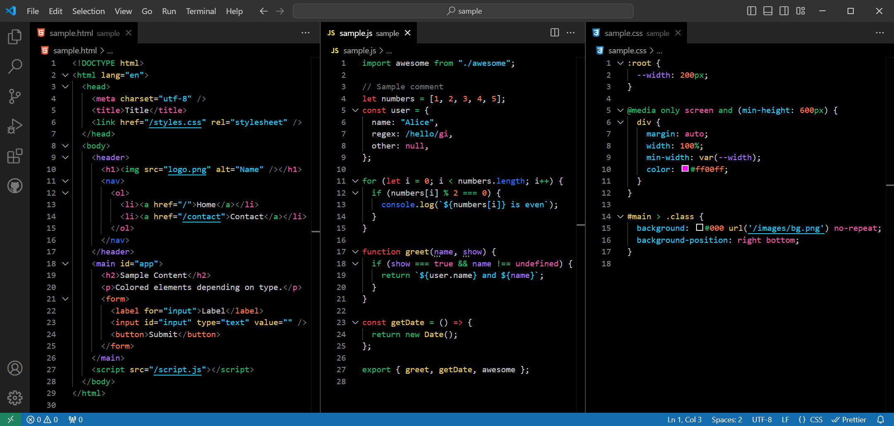
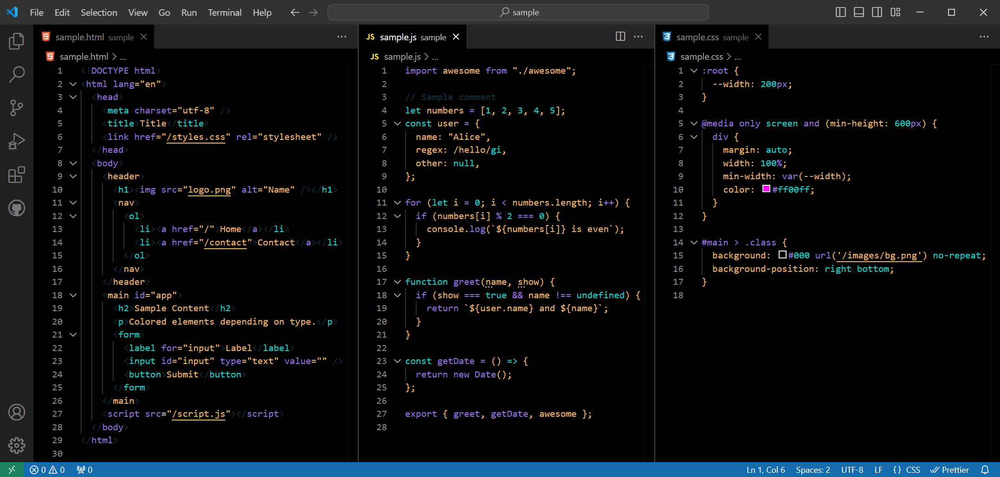
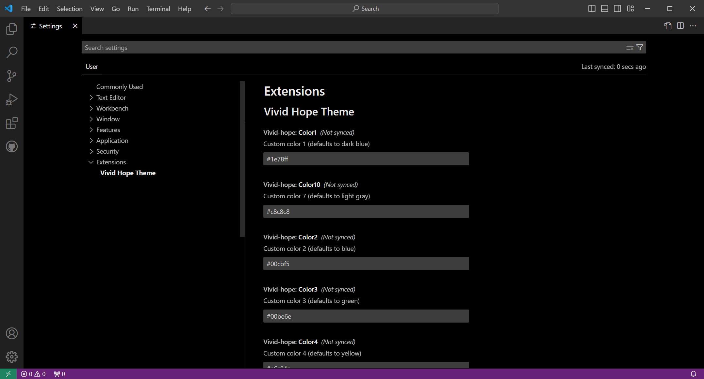

# [Vivid Hope Theme](https://marketplace.visualstudio.com/items?itemName=matanich.vivid-hope-theme-vscode) for VS Code

[](https://vscode.dev/theme/matanich.vivid-hope-theme-vscode)
[](https://marketplace.visualstudio.com/items?itemName=matanich.vivid-hope-theme-vscode)
[](https://marketplace.visualstudio.com/items?itemName=matanich.vivid-hope-theme-vscode)
[](https://marketplace.visualstudio.com/items?itemName=matanich.vivid-hope-theme-vscode)
[](https://marketplace.visualstudio.com/items?itemName=matanich.vivid-hope-theme-vscode)

🎨 **Customizable Colors:** Easily override any of 10 base colors!

Finally, a theme that allows you to **easily configure colors**, without messing with `workbench.colorCustomizations`. Any of the 10 colors used can be overridden in [user settings](https://code.visualstudio.com/docs/getstarted/settings#_user-settings).

## Screenshots

### Default Colors



### Example of Customization



## How to Customize Colors

### JSON file

To customize the colors, add any of the following settings to your `user/settings.json` file:

1. Open the Command Palette (`Ctrl+Shift+P` or `Cmd+Shift+P` on macOS)
2. Type and select **"Preferences: Open Settings (JSON)"**
3. Add your color customizations:

```jsonc
{
  "vivid-hope.color1": "#1e78ff", // dark blue
  "vivid-hope.color2": "#00cbf5", // light blue
  "vivid-hope.color3": "#00be6e", // green
  "vivid-hope.color4": "#e6c84c", // yellow
  "vivid-hope.color5": "#ff783d", // orange
  "vivid-hope.color6": "#f03c46", // red
  "vivid-hope.color7": "#f05aaa", // pink
  "vivid-hope.color8": "#aa78ff", // purple
  "vivid-hope.color9": "#787878", // dark gray
  "vivid-hope.color10": "#c8c8c8" // white
}
```

For the above example, the following were used:

```jsonc
{
  "vivid-hope.color1": "#e6b465",
  "vivid-hope.color2": "#e6b465",
  "vivid-hope.color8": "#e6b465",
  "vivid-hope.color10": "#e6b465",
  "vivid-hope.color3": "#9575db",
  "vivid-hope.color4": "#9575db",
  "vivid-hope.color5": "#00cbc4",
  "vivid-hope.color6": "#00cbc4",
  "vivid-hope.color7": "#00cbc4",
  "vivid-hope.color9": "#0e3747"
}
```

**Note:** this extension does not read settings from project or workspace settings.

## Settings Editor

1. Open the Command Palette (`Ctrl+Shift+P` or `Cmd+Shift+P` on macOS)
2. Type and select **"Preferences: Open Settings"**
3. Locate the settings for `Vivid Hope Theme`
4. Add your color customizations:



## Installation

To install the Vivid Hope Theme:

1. Open Visual Studio Code.
2. Go to the Extensions view by clicking on the Extensions icon in the Activity Bar on the side of the window or by pressing `Ctrl+Shift+X` (`Cmd+Shift+X` on macOS).
3. Search for **"Vivid Hope Theme"** and click **"Install"**.

## More information

- **Note:** I made this theme for myself. I primarily work in HTML, CSS, and JavaScript.
- This is based off the **Default Dark+** theme and some colors are inspired by [An Old Hope Theme](https://github.com/dustinsanders/an-old-hope-theme-vscode).
